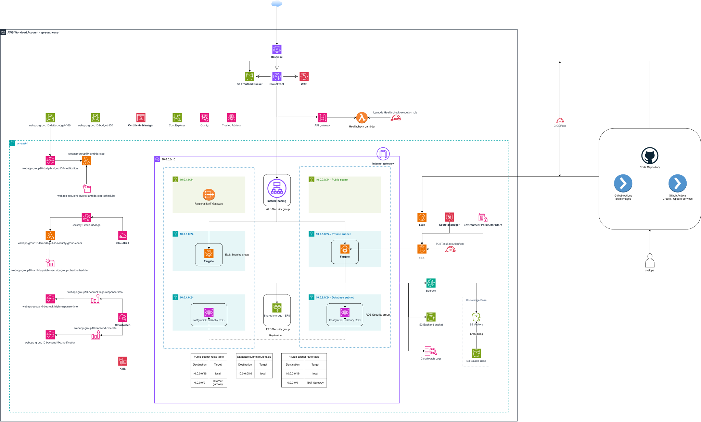
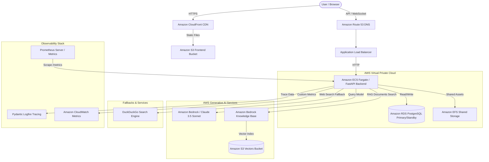

# AWS-Native Full-Stack AI Agent

A production-ready, AWS-native full-stack application featuring a Next.js frontend and a FastAPI backend with a conversational AI agent powered by `pydantic-ai`. The application is built to leverage AWS managed services for web hosting, secure data storage, generative AI execution, and unified observability.

---

## AWS Architecture Diagram

Below is the detailed network and resource deployment layout across AWS regions:

[](diagram.svg)

### High-Level Component Flow
Here is the simplified request and data routing path:



---

## AWS Services Architecture

The infrastructure is provisioned using resource definitions mapped to the workload account **ap-southeast-1** (Singapore) and region **us-east-1** (N. Virginia):

### Generative AI and RAG
*   **Amazon Bedrock**: Runs the conversational agent using the `BedrockConverseModel` (Claude 3.5 Sonnet).
*   **Amazon Bedrock Knowledge Base**: Grounding agent answers in knowledge documents and vector indices stored in S3 (`S3 Source Base` and `S3 Vectors`).

### Compute and Orchestration
*   **Amazon ECS (Fargate)**: Serverless container compute running the FastAPI Python backend under the private subnets.
*   **Application Load Balancer (ALB)**: Internet-facing load balancer handling traffic routing, SSL termination, and distributing requests to ECS tasks.
*   **Amazon CloudFront**: Content Delivery Network (CDN) serving the Next.js static frontend from the `S3 Frontend Bucket`.
*   **AWS Lambda**:
    *   `Healthcheck Lambda`: Handles backend health dashboard and monitoring.
    *   `ai-agent-lambda-public-security-group-check`: Compliance remediation logic for exposed ports.
    *   `ai-agent-lambda-stop`: Stop compute scheduler handler for cost optimization.

### Data and Storage
*   **Amazon RDS (PostgreSQL)**: Primary (`PostgreSQL Primary RDS`) and standby (`PostgreSQL Standby RDS`) managed database instances with active replication for transactional data.
*   **Amazon S3**: Hosts static frontend assets and stores RAG knowledge source documents.
*   **Amazon EFS**: Elastic File System (`Shared storage - EFS`) for shared persistent storage across backend containers.

### Security and Operations
*   **AWS Secrets Manager**: Securely stores database passwords, third-party API keys, and environment variables (`Secret manager`).
*   **AWS KMS**: Handles encryption keys for RDS, S3, and EFS volumes.
*   **Amazon Route 53**: Scalable cloud DNS routing users to CloudFront.
*   **Amazon WAF**: Web Application Firewall protecting CloudFront from common web exploits.
*   **Self-Health Security Guard (EventBridge + Lambda)**: Active compliance. When an event is captured for security group rule creation (like exposing port `22` or `5432` to `0.0.0.0/0`), `ai-agent-lambda-public-security-group-check-scheduler` triggers the compliance Lambda function to immediately revoke the rule.
*   **Auto-Shutdown Scheduler (EventBridge + Lambda)**: Cost control scheduler rule `ai-agent-invoke-lambda-stop-scheduler` periodically invokes the stop compute Lambda (`ai-agent-lambda-stop`) to turn off unprotected EC2, RDS, and ECS resources (those lacking protection tags).
*   **AWS Budgets & Cost Alarms**:
    *   Daily limit budget warning: `ai-agent-daily-budget-100` / `ai-agent-daily-budget-100-notification`.
    *   Overall budget threshold: `ai-agent-budget-150`.
*   **CloudWatch Performance Alarms**:
    *   5XX error rates: `ai-agent-backend-5xx-rate` / `ai-agent-backend-5xx-notification`.
    *   AI model latency: `ai-agent-bedrock-high-response-time`.

---

## Project Structure

```
ai_agent/
├── backend/                # FastAPI application, tests, and database migrations
├── frontend/               # Next.js frontend web application and tests
├── infra/                  # Terraform configurations for AWS infrastructure
├── lambda/                 # AWS Lambda python handlers
├── cloudformation/         # AWS CloudFormation deployment templates & scripts
├── sam/                    # AWS SAM serverless application configurations
├── docs/                   # Additional architecture and developer guides
├── .github/workflows/      # CI/CD deployment pipelines
├── README.md               # Root documentation
└── .env.example            # Canonical local configuration template
```

---

## Setup and Local Development

### Prerequisites
*   Python 3.12+ (managed via `uv` or `venv`)
*   Node.js 20+ or Bun
*   Docker & Docker Compose (optional, for local DB/Redis)
*   AWS CLI configured with appropriate permissions (for Bedrock/IaC)

### 1. Unified Environment Configuration
Create a local `.env` file at the root of the repository. This file serves as the local source of truth for all configurations (backend, frontend, Terraform, and scripts).

```bash
cp .env.example .env
```

Edit the `.env` file and configure your settings:
*   AWS credentials & region
*   Bedrock Model IDs & Knowledge Base configurations
*   Database & Redis credentials
*   Frontend API URLs (`NEXT_PUBLIC_API_URL`, `NEXT_PUBLIC_WS_URL`)

---

### 2. Backend Setup

1.  **Navigate to the backend directory**:
    ```bash
    cd backend
    ```

2.  **Create a Virtual Environment & Install Dependencies**:
    Using `uv` (recommended):
    ```bash
    uv sync
    ```
    Using standard `pip`:
    ```bash
    python -m venv .venv
    .venv\Scripts\activate      # Windows
    source .venv/bin/activate    # macOS/Linux
    pip install -e .[dev]
    ```

3.  **Run Database Migrations**:
    Apply database schema updates via Alembic:
    ```bash
    alembic upgrade head
    ```

4.  **Start the Backend Server**:
    ```bash
    uvicorn app.main:app --reload --port 8000
    ```
    Access the interactive API documentation at `http://localhost:8000/docs`.

---

### 3. Frontend Setup

1.  **Navigate to the frontend directory**:
    ```bash
    cd frontend
    ```

2.  **Install Dependencies**:
    Using `bun` (recommended):
    ```bash
    bun install
    ```
    Using `npm`:
    ```bash
    npm install
    ```

3.  **Start the Dev Server**:
    ```bash
    bun run dev
    # or
    npm run dev
    ```
    Open `http://localhost:3000` in your browser.

---

## Running Tests

### Backend Unit & Integration Tests
Run tests locally using pytest. (Integration tests requiring a database are skipped automatically if PostgreSQL is not running locally).

```bash
cd backend
.venv\Scripts\pytest
# or
uv run pytest
```

### Frontend Tests
Run frontend component tests using Vitest:

```bash
cd frontend
bun run test:run
# or
npm run test:run
```

Run E2E tests using Playwright:
```bash
bun run test:e2e
```

---

## Deployment to AWS

### A. Deploying via Terraform
1.  Navigate to the `infra` directory:
    ```bash
    cd infra
    ```
2.  Initialize Terraform:
    ```bash
    terraform init
    ```
3.  Deploy using the provided wrappers (loads variables automatically from your root `.env`):
    *   **Windows (PowerShell)**: Run `./tf.ps1 plan` then `./tf.ps1 apply`
    *   **Unix (Bash)**: Run `./tf.sh plan` then `./tf.sh apply`

### B. Deploying via CloudFormation
Use the deployment helper script:
```bash
cd cloudformation
./deploy.sh
```

### C. CI/CD Workflow
A GitHub Actions workflow is defined in `.github/workflows/deploy.yml` which automates:
1.  Running backend lints, formats, and tests.
2.  Running frontend builds and checks.
3.  Building Docker images and pushing them to AWS ECR.
4.  Deploying the updated images to ECS Fargate.